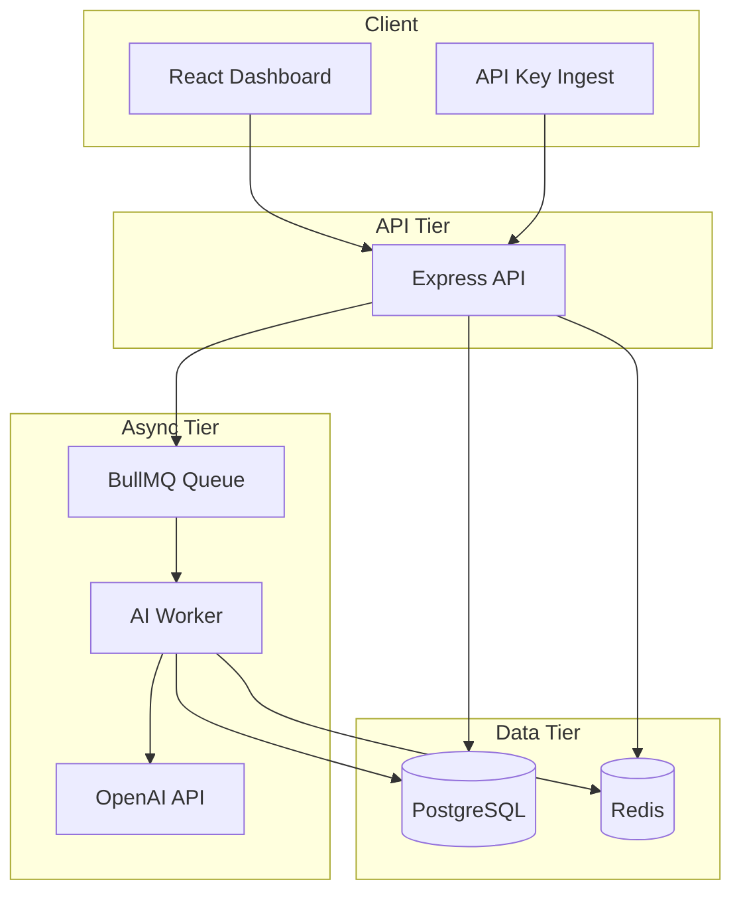

# LogLens AI — Architecture

## Overview

LogLens AI is a three-tier async processing system:

1. **API layer** — Express handles auth, validation, CRUD, and enqueueing
2. **Queue layer** — BullMQ on Redis decouples HTTP from AI latency
3. **Worker layer** — Separate Node process runs OpenAI analysis and persists results

## Multi-tenancy

- Users own **Projects** (each has a unique `apiKey`)
- **Logs** belong to a project
- All JWT-authenticated log queries filter by `project.userId = req.userId`
- API-key ingest validates `projectId` matches the key's project

## Caching strategy

- Paginated log list responses cached in Redis for 60 seconds
- Keys include `userId`, page, limit, search, and severity
- Cache cleared on log create/update/delete and after worker completion

## Queue reliability

- Queue name: `log-analysis`
- Retries: 3 with exponential backoff
- Log status: `pending` → `processing` → `completed` | `failed`
- Failed jobs store `errorMessage` on the log row

## Scaling considerations

| Component | Scale approach                                      |
|-----------|-----------------------------------------------------|
| API       | Horizontal replicas behind load balancer            |
| Worker    | Increase worker instances / concurrency             |
| Redis     | Managed Redis; use `rediss://` for TLS              |
| Postgres  | Connection pooling; read replicas for analytics     |
| Cache     | Replace `KEYS logs:*` with SCAN or versioned prefix |

## Failure modes

- **Worker down:** Logs remain `pending`; health check does not cover queue depth
- **OpenAI errors:** Job retries; final failure sets log `status: failed`
- **Invalid API key:** 401 on ingest route

## Deployment topology

Typical production layout:

- Frontend: static hosting (Vercel, Netlify, or Nginx container)
- API: Railway / Render / VPS container (`Dockerfile.api`)
- Worker: separate container (`Dockerfile.worker`)
- PostgreSQL + Redis: managed services

docker exec -it loglens-backend npx prisma studio --port 5555 --browser none

# How to connect to prisma through Railway CLI in production?
1. railway login
2. railway link
3. railway shell
4. npx prisma migrate deploy